# Frontend Table of Contents

Lay out and discuss the Flow and the Objects and Methods that control it.

## 1. SearchViewController
File: (`~/Controllers/SearchVCs/SearchViewController`)
1. Loads SearchView (`~/Views/SearchViews/SearchView`)
2. UITextField Recieves Input
3. SearchButtonTapped
	-- If UITextField is Empty, display error message
	-- Else Display Results in `RecipeListCollectionView`
	
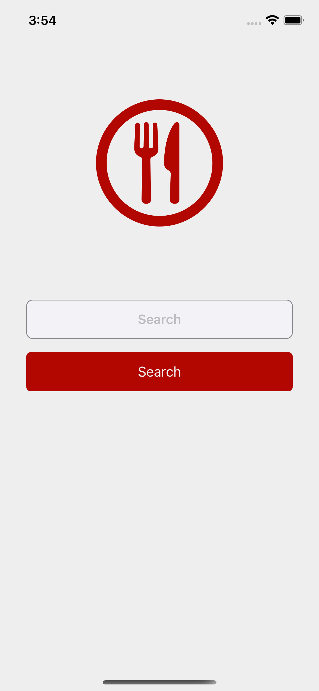   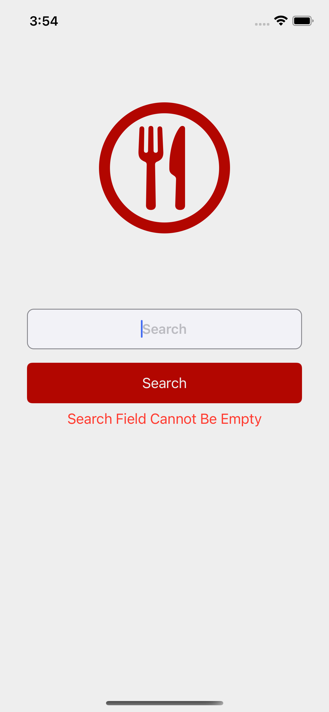

## 2. RecipeListCollectionView
Displays a Collection List of Results (`loadRecipes(for: searchedRecipe`)
1. CollectionViewCells (`~/Views/Elements/RecipeCell`)
	-- didSelectItemAt loads RecipeViewController (`~/Controllers/RecipeVCs/RecipeViewController`)
	
	*Note: Need default screen if there are no results*
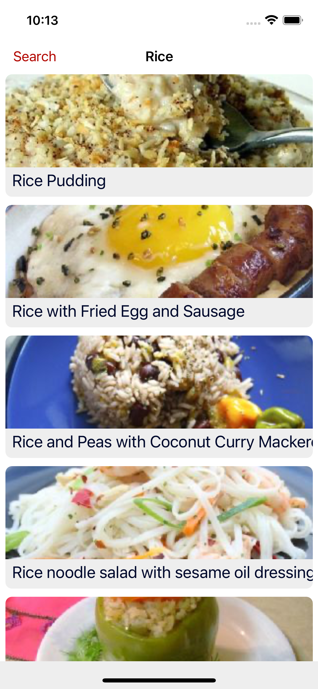

## 3. RecipeViewController
 - Methods called on `viewWillAppear`:
	1. `loadRecipeByID(for: recipeID)` (local method)
	2. `getInstructions(for: recipeID)` (local method) 
 - Loads RecipeView (`~/Views/RecipeViews/RecipeView`)
  
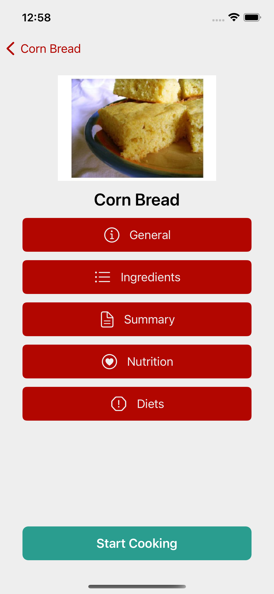

### 3.1 General Button (tapped)
- Loads GeneralModal (`~/Views/Modals/GeneralModal`)
- Displays Basic Info, i.e. Time To Make, # of Servings, etc.
- Data populated from method `generateGeneralInfo(for selectedRecipe: Recipe)` File: (`~/Controllers/VCMethods/DataGeneration/GeneralInfo`) *_Extension of RecipeViewController_*

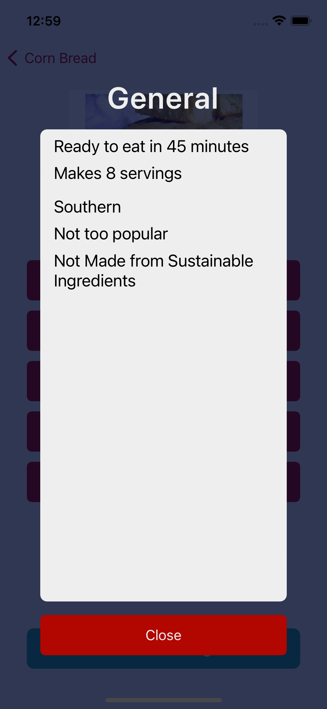

### 3.2 Ingredients Button (tapped)
- Loads IngredientsModal (`~/Views/Modals/IngredientsModal`)
- Displays Basic Info, i.e. Time To Make, # of Servings, etc.
- Data populated from method `generateGeneralInfo(for selectedRecipe: Recipe)` (`~/Controllers/VCMethods/DataGeneration/GeneralInfo`) *_Extension of RecipeViewController_* 

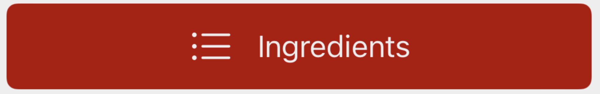
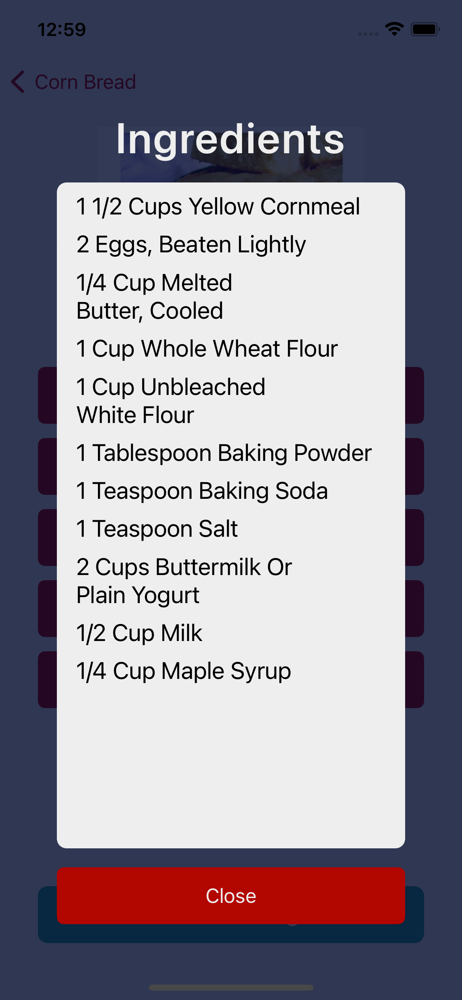

### 3.3 Summary Button (tapped)
- Loads IngredientsModal (`~/Views/Modals/Summary/Modal`)
- Displays all Summary of Recipe from API
- Data populated from method `generateSummary(for selectedRecipe: Recipe)` (`~/Controllers/VCMethods/DataGeneration/GenerateSummary`) *_Extension of RecipeViewController_*

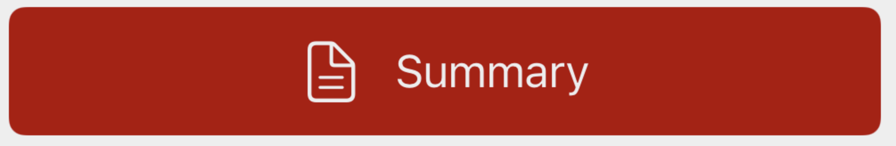
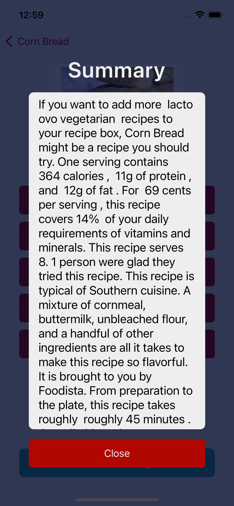

### 3.4 Macros Button (tapped)
- Loads SummaryModal (`~/Views/Modals/MacrosModal`)
- Displays Nutritional Information, i.e. calories, iron, vitamins, etc
- Data populated from method `generateDietsInfo(for selectedRecipe: Recipe)` (`~/Controllers/VCMethods/DataGeneration/GenerateMacros`) *_Extension of RecipeViewController_*

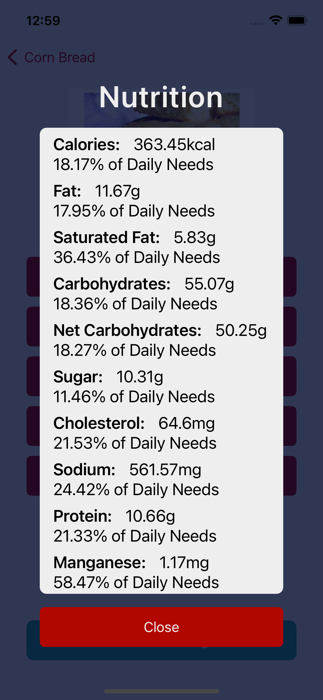

### 3.5 Diets Button (tapped)
- Loads SummaryModal (~/Views/Modals/DietsModal)
- Displays Diets Information, i.e. vegan, gluten free, keto, etc
- Data populated from method `generateMacrosModel(for selectedRecipe: Recipe)` (`~/Controllers/VCMethods/DataGeneration/GenerateDietsInfo`) *_Extension of RecipeViewController_*

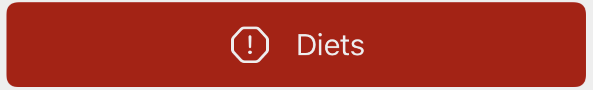
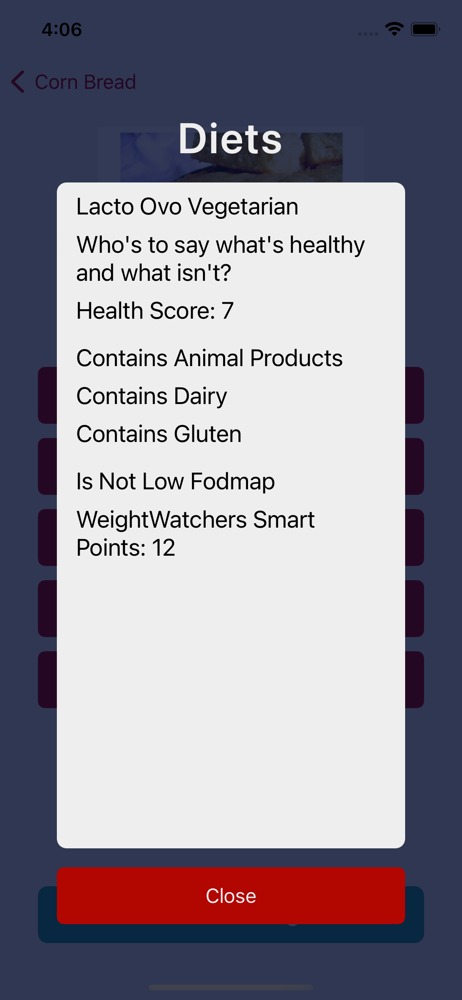

### 3.6 Start Cooking Button (tapped)
- Loads StagedCardContainerViewController (`~/Controllers/StagedCards/CardContainerViewController`)
- Calls Method `buildCards(ingredients: [String], instructionsDictionary: [Int: String], ingredientDictionary: [Int: [String]]) -> [Card]` (`~/Controllers/VCMethods/CardRelated/CardBuilder`)

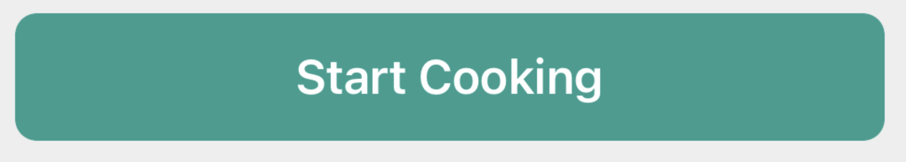

## StagedCardContainerViewController
